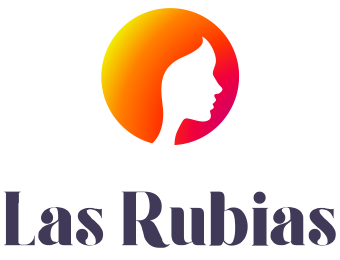

#  React Card Creator Las Rubias

The projects go from the Card Creator JS version from Undefined team to a refactorizing  React web.

##  Steps in the project

We inherit the JavaScript code from Undefined team. They did a  responsive web to generate personal cards and share them via Twitter using vanilla JS. 
The first step to us was understood the inherit code and then refactorized it. For that purpose, we study the code, understand the functions so we could refactorize it after. 
We include some improvements, logic to correct bugs and comments. 

After that, we introduce React in the project, creating a react app and adding functions and components step by step. We support in the inherent code, especially the HTML and SASS.

#  Las Rubias

This team was created in the third Sprint in Adalab Easley promotion. 
The components are Maria Badanina, Stepahnie Guevara, Desirée García and Joana Jiménez. 
We work as a team based on agile management with daily, trello communication, pair programming, pull request and self-organization to execute the project. 
You could obtain more info about each of us clicking in our icons in this repository. 

##  Improvements

Limit the number of possible skills checked.
Add the theme color to the skills tags. 
Delete repeated functions.
Handle the web from the state.
Add routes in the pages (home and main).

## Use of the project

As developer:
Download the file and do npm install in your computer. Then do npm start to see the project working. If you want to improvements or fix something, please, open an issue in the repository and we will review your work. You could also ask us to know some possible improvements.

As user of the web: 
Please enter in http://beta.adalab.es/easley-s3-lasRubias/#/ page. In the first page, you have to click on button START. You will be sent to the card creator page, add color and font theme. Introduce your information and click (two times) to CREATE VISIT CARD and you get the link to your card and also to share it on Twitter. 

 
